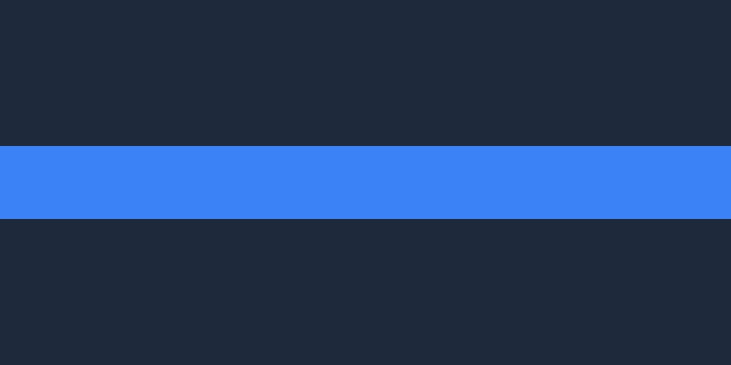
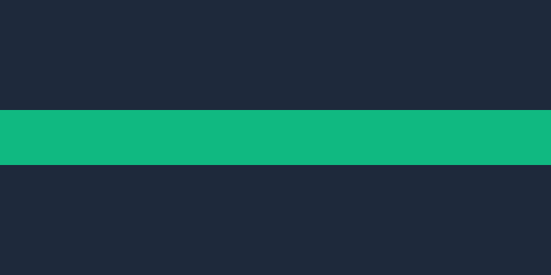
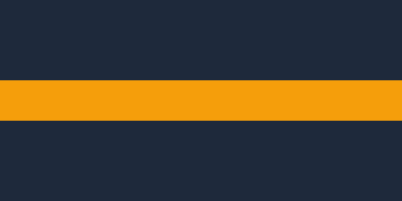
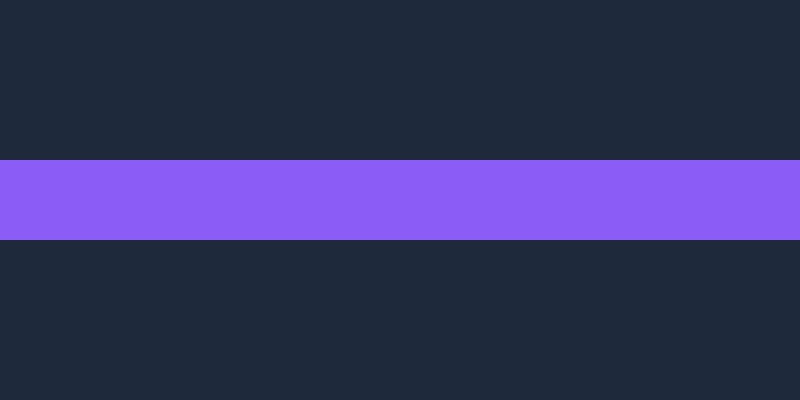
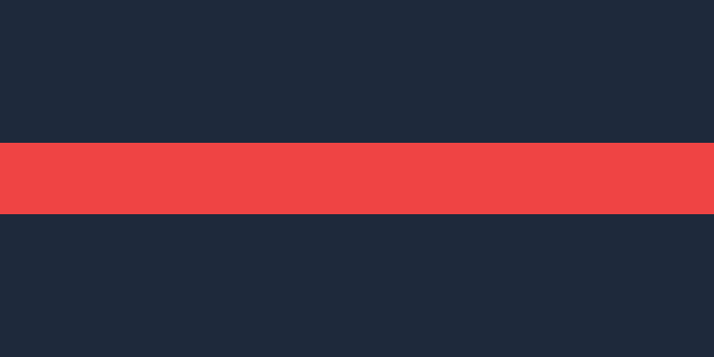

# Author a Workflow — Step-by-Step Tutorial

This guide walks you through creating, connecting, configuring, saving,
and running a workflow using the Agent Fabric visual editor.

> **Prerequisites**: The application is running locally (`npm run dev`) or
> you have access to a deployed instance.

---

## 1. Open the Editor

Navigate to the application root URL. The editor loads automatically with
three panels:

| Panel             | Location | Purpose                             |
| ----------------- | -------- | ----------------------------------- |
| **Palette**       | Left     | Drag-and-drop library of node types |
| **Canvas**        | Centre   | Visual graph editing surface        |
| **Property Grid** | Right    | Configuration for the selected node |

<!-- screenshot: editor-layout.png -->

> **Tip**: Collapse or expand the side panels with the toggle button in the
> toolbar, or drag the resizable separators to adjust panel widths.

---

## 2. Add Nodes from the Palette

The palette groups nodes by category. Available node types include:

| Node                       | Description                                              |
| -------------------------- | -------------------------------------------------------- |
| **Start**                  | Entry point of every workflow — exactly one per workflow |
| **End**                    | Exit point — marks workflow completion                   |
| **Task**                   | Performs an action (API call, script, etc.)              |
| **Decision**               | Conditional branch — routes execution based on a rule    |
| **Loop (while / foreach)** | Repeats a sub-graph until a condition is met             |

### Drag a node onto the canvas

1. Locate the desired node type in the palette (left panel).
2. Click and hold the node, then drag it onto the canvas.
3. Release to place it. The node appears at the drop position.

<!-- screenshot: add-node.png -->

Repeat this to add all the nodes your workflow requires. A minimal workflow
needs at least a **Start** node and an **End** node.

---

## 3. Connect Nodes

Connections (edges) define the execution flow between nodes.

1. Hover over the **output port** (right side) of the source node — the port
   highlights to indicate it is connectable.
2. Click and drag from the output port toward the **input port** (left side)
   of the target node.
3. Release over the target input port. A new edge appears linking the two
   nodes.

<!-- screenshot: connect-nodes.png -->

### Connection rules

- Each input port may accept one or more inbound edges depending on its
  configuration.
- Required input ports display a **missing-connection indicator** (red dot)
  when they have no inbound edge.
- Decision nodes have multiple output ports for different branch conditions
  (e.g. "true" / "false").
- Loop-back edges are rendered with a dashed indigo line and connect a
  loop's body back to the loop node.

> **Keyboard**: You can also connect nodes using the keyboard. Focus a
> source port, press **Enter** to start a connection, then **Tab** to the
> target port and press **Enter** again to complete it.

---

## 4. Edit Node Properties

Click any node on the canvas to select it. The **Property Grid** (right
panel) updates to show the selected node's configurable fields.

<!-- screenshot: property-grid.png -->

### Field types

| Field   | Widget          | Example                    |
| ------- | --------------- | -------------------------- |
| String  | Text input      | Node label, API endpoint   |
| Number  | Numeric input   | Retry count, timeout       |
| Boolean | Toggle switch   | Enable/disable a flag      |
| Enum    | Dropdown select | HTTP method (GET, POST, …) |
| Code    | Monaco editor   | Inline script / expression |
| Array   | Sortable list   | Input parameters           |
| Object  | Nested fieldset | Complex configuration      |
| Secret  | Masked input    | API key (value hidden)     |

Validation errors appear inline — a red border and message describe what
needs to be corrected. The toolbar also shows a validation error count when
issues exist.

---

## 5. Save the Workflow

The editor supports both manual and automatic saving.

### Auto-save

Changes are automatically persisted to the browser's local storage as you
work. A connection-status indicator in the toolbar reflects the current
save state.

### Manual save

Click the **Save** button (💾) in the toolbar — or press **Ctrl+S**
(**⌘+S** on macOS) — to explicitly save the workflow. A toast
notification confirms the save succeeded or reports any error.

<!-- screenshot: save-workflow.png -->

### Export / Import

Use the **Save / Load** bar to download the workflow as a JSON file or
import a previously exported workflow.

---

## 6. Run the Workflow

Once your workflow is connected and valid, you can execute it directly from
the editor.

1. Click the **Run** button (▶) in the toolbar.
2. Execution starts from the **Start** node and progresses through each
   connected node.
3. Active nodes and edges animate in real-time:
   - **Running** nodes pulse with a blue highlight.
   - **Succeeded** nodes flash green.
   - **Failed** nodes flash red.
   - Edges animate with a flow indicator when active.

<!-- screenshot: run-workflow.png -->

### Inspecting results

- Open the **Run Inspector** panel to view the event timeline for the
  current run.
- Each node's execution state (status, timing, output) is available in the
  inspector.

### Stopping a run

Click the **Stop** button (⏹) in the toolbar to halt a running workflow.

---

## 7. Additional Tips

### Undo / Redo

Use **Ctrl+Z** / **Ctrl+Shift+Z** (or **⌘+Z** / **⌘+Shift+Z** on macOS)
to undo and redo graph changes. The toolbar also has dedicated undo/redo
buttons.

### Auto-layout

Click the **Auto-layout** button (grid icon) in the toolbar to
automatically arrange nodes using the ELK layout engine. This is useful
after adding many nodes to tidy up the graph.

### Snap to grid

Toggle the **Snap to Grid** button in the toolbar to align nodes to a
regular grid while dragging.

### Theme switching

Use the **sun/moon** toggle in the toolbar to switch between light and dark
themes. Your preference is persisted across sessions.

### Language switching

Use the **locale switcher** dropdown to change the UI language (English or
French). The selection is persisted in local storage.

---

## Quick-Start Checklist

- [ ] Open the editor
- [ ] Drag a **Start** node and an **End** node onto the canvas
- [ ] Add one or more **Task** / **Decision** / **Loop** nodes
- [ ] Connect the nodes from Start → … → End
- [ ] Select each node and fill in its properties
- [ ] Save the workflow (Ctrl+S or auto-save)
- [ ] Click **Run** and observe execution

Congratulations — you've authored and run your first workflow! 🎉

---

> **Updating screenshots**: To regenerate the screenshot images, run
> `node scripts/generate-doc-screenshots.mjs`. To replace them with real
> application captures, use Playwright or your browser's screenshot tools
> while the app is running (`npm run dev`).
